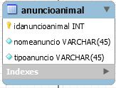
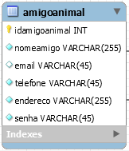
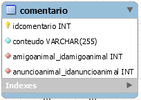

# Modelo inicial de dados

As principais entidades do sistema modeladas _so far_, definindo o idioma do
projeto e esperanças de compreensão e funcionamento.

## Anuncioanimal

* anuncios com animais disponíveis para adoção

## Amigoanimal

* usuários do sistema cadastrados que podem cadastrar novos anúncios e
  comentar em anúncios existentes

## Comentario

* uma mensagem relacionada a um anúncio e a um usuário

